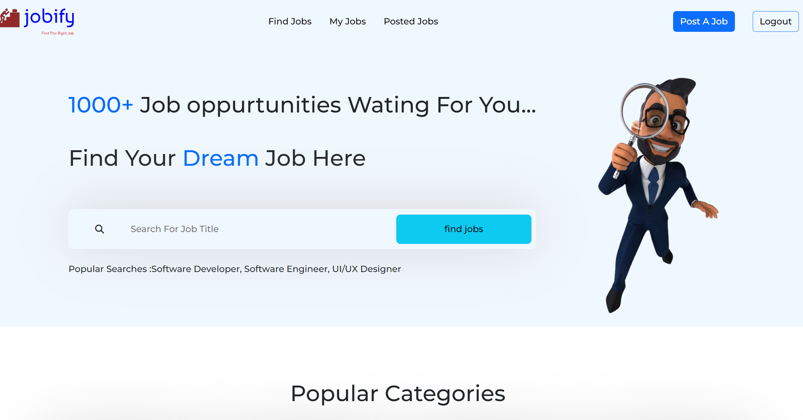
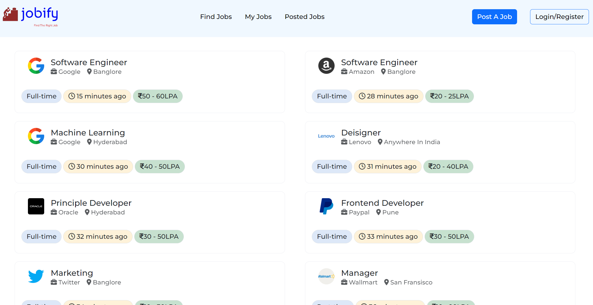
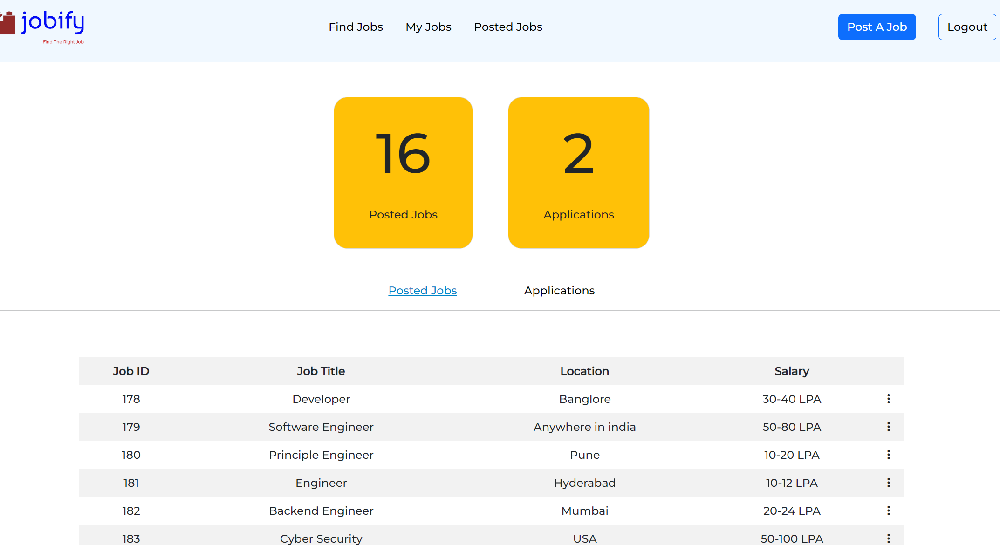
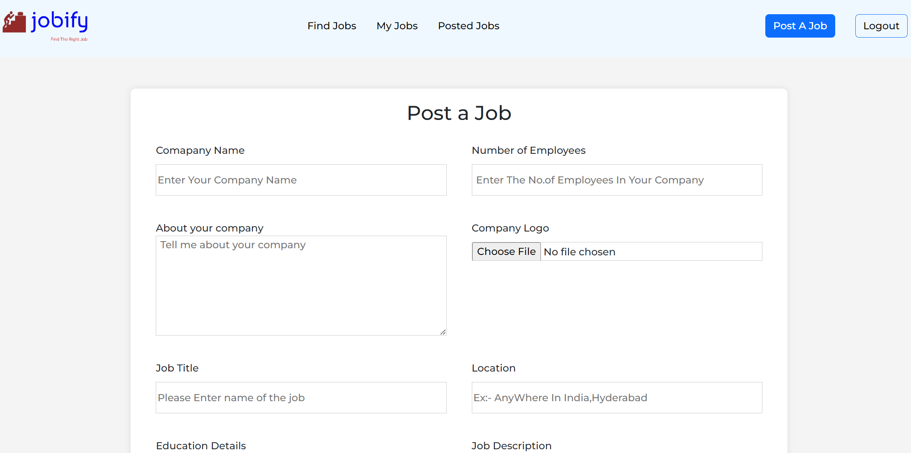

Job Portal Management System

Live Demo "https://job-portal.free.nf/index.php".

some images:-

Installation Install XAMPP:

Download and install XAMPP, a cross-platform web server solution that includes Apache, MySQL, PHP, and more.
Start PHP and MySQL Servers:

Open XAMPP Control Panel and start the Apache and MySQL servers.
Navigate to htdocs:

Open the XAMPP installation directory and locate the "htdocs" folder.

Overview
Welcome to the Job Portal Management System, a web application developed to streamline the job posting and application process. This system is designed to be user-friendly and efficient, providing features for both job seekers and employers. The technologies used in this project include HTML, CSS, JavaScript, Bootstrap, PHP, and MySQL.

    
Features

For Job Seekers:

1. View Jobs:
   - Browse through a list of available job postings.
2. Apply for Jobs:
   - Submit job applications online.
3. Track Applications:
   - Monitor the status of submitted job applications.
4. User Account Management:
   - Create an account to access personalized features.
   - Reset password for account security.

For Employers:

1. Post Jobs:
   - Easily create and publish new job listings.
2. Manage Jobs:
   - Edit or delete existing job postings.
3. Track Applications:
   - Keep track of received job applications.
4. User Account Management:
   - Employers can create accounts for enhanced job posting and management capabilities.
   - Reset password for account security.

Technologies Used
HTML: Structure of the web pages.
CSS: Styling and layout of the web pages.
JavaScript: Enhancing interactivity and user experience.
Bootstrap: Front-end framework for responsive design.
PHP: Server-side scripting for dynamic content.
MySQL: Database management for storing and retrieving data.
